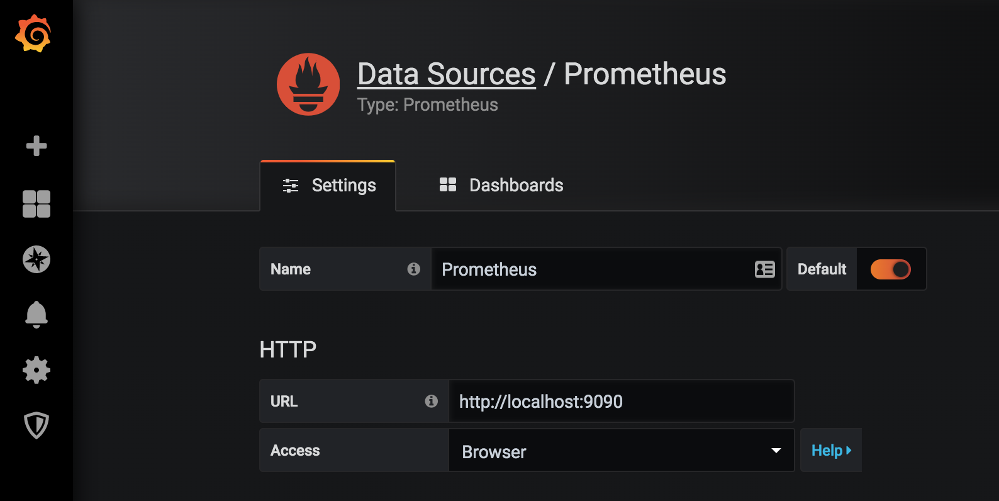

# Monitoring Demo with Prometheus and Grafana

This is just PoC, to demonstrate the capabilities of Prometheus, Prometheus Node Exporter and Grafana.

## Running the demo
To run this just edit the environmental variables on docker-compose.yml file, then go to the terminal and run this:

```bash
docker-compose up -d
```

## Configuring Grafana
1. Open the browser and go to `localhost:3000`
2. use these credentials - user:admin, password:<GF_SECURITY_ADMIN_PASSWORD>
3. Then go to Configuration/Datasources and configure Prometheus datasource this way:

4. Now go to + symbol / import, Now paste this number `1860` then click on `Load` button
5. Choose the Prometheus datasource you just created and click on `import`
6. Your dashboard is ready, go explore it